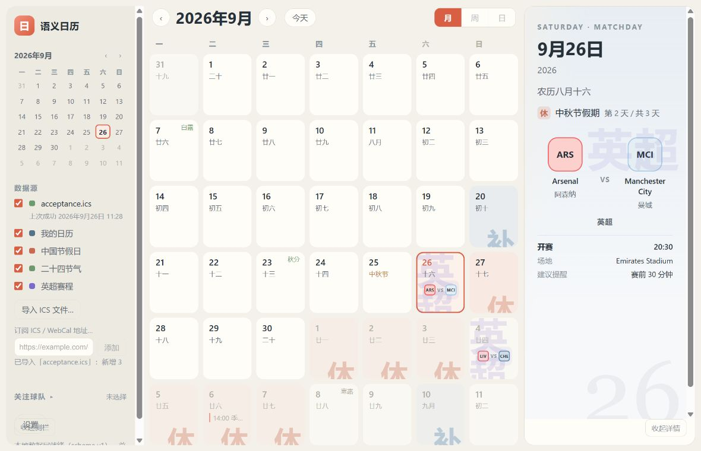
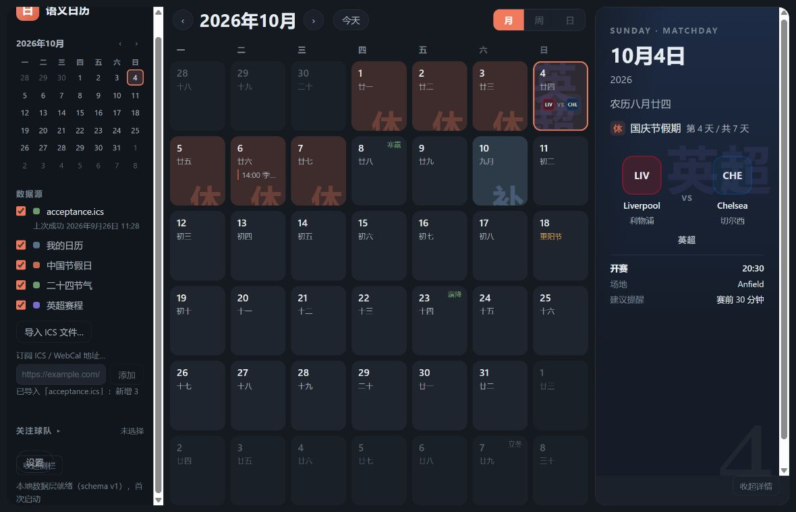

# 当前版本运行验收与参考图对比

日期：2026-09-26。代码：`6245328`。范围：当前工作区、GitHub SC-001–SC-024 工单、`docs/app-spec.md`、`docs/ui-design.md` 及浅色/深色参考图。

> 本文记录修复前的审查结果；后续七项用户反馈修复和新增交互见 [修复验收](fixes.md)。

## 结论

功能骨架与大部分 v0.1 链路已经实现，当前源码能编译并启动 Windows 桌面应用。不过，“24 张子工单均已关闭”不足以说明当前版本可以全部通过验收：本次复现了两项影响交互和详情正确性的问题、两项视觉降级问题，以及最小窗口下的日期文字遮挡。参考图中最显著的队徽、联赛狮标、节日/节气照片和赛事海报氛围仍没有进入默认产品。

建议先修复设置入口与日期详情，再补齐视觉资源和布局。现有单元测试不能替代真实布局与连续操作验收。

## 1. 本次实际执行与证据边界

| 项目 | 本次结果 |
| --- | --- |
| GitHub 工单 | 实际读取所有工单正文、评论和状态。SC-001–024 共 24 张子工单全部 CLOSED；父 Epic #1 仍 OPEN，正文复选框仍未勾选，也未登记 SC-023/024 |
| TypeScript/React 测试 | `npm run test`：83 个文件、957 个用例通过，56.91 秒 |
| 当前前端构建 | `npm run build` 成功，127 个模块；同时完成 TypeScript 检查 |
| 静态检查 | `npm run lint` 通过 |
| Rust 后端测试 | `cargo test --manifest-path apps/desktop/src-tauri/Cargo.toml`：19 个用例通过 |
| 旧桌面构建 | 仓库现有 release 可执行文件能启动，但文件时间为 09-25 12:23，早于之后的生产代码更新，因此未把它当作当前源码的验收结果 |
| 当前源码桌面版 | 使用运行中的 Vite 服务编译并启动 Tauri 开发版；09-26 11:28:42 生成 debug 可执行文件，主窗口标题“语义日历”，进程 Responding=True |
| 当前前端实看 | 真实 App、MonthView、Inspector 和 CSS；1180×760 默认窗口、820×560 最小窗口；浅色、深色、导入、比赛、普通事件、切月、侧栏操作 |
| 比赛数据场景 | `harness/` 直接加载当前 `/src/main.tsx`，仅桌面 IPC 边界使用隔离浏览器存储。通过真实文件选择器导入 `acceptance.ics`，真实运行解析→标准化→Matcher→存储→月格→详情。测试日程未写入用户的桌面日历 |

**限制**：当前工具没有原生桌面 UI 操作能力。桌面启动和窗口响应已确认，视觉与连续交互在相同前端组件的浏览器渲染中核对。系统通知真正弹出、托盘左键/右键、安装/卸载、真实远程 WebCal 订阅、长时间后台运行，本次没有重新做实机验收；相应结论来自现有自动测试、源码与仓库历史记录，不能称为本次实测通过。隔离场景的权限、文件 IO、托盘返回值是测试替身，不是系统能力的证据。

外部图像分析调用因图片传输权限被自动审批拒绝；参考图最终使用本地查看完成对比，没有通过外部图像服务分析。

## 2. 已复现的问题

### R1 · P1：设置按钮被收起侧栏按钮覆盖

关联：SC-004 / SC-018。

复现：1180×760、两侧栏展开→导入本目录的三条事件→将侧栏滚到下方→点击“设置”。点击可能变成“收起侧栏”；键盘聚焦设置后按 Enter 可以正常打开设置。

测量：设置按钮 y=669.29、h=32.86；收起按钮 y=676.29、h=29.14。`document.elementFromPoint()` 在设置按钮中心命中的是 `.pane-toggle-collapse`。这是真实遮挡，不只是文字拥挤。导入后增加的来源与反馈使 `.sidebar` 内容超出自身高度，后面的收起按钮占用了同一位置。

位置：`apps/desktop/src/index.css` 的 `.pane-sidebar`（152）、`.sidebar`（235）、`.sidebar-footer`（315）与 `.pane-toggle-collapse`（204）；`layout/AppShell.tsx` 的按钮与 sidebar 内容为同级。

改进：让内容区独立滚动；设置和收起入口保留各自稳定、不重叠的区域。用“默认窗口 + 导入来源 + 鼠标点击设置”做真实浏览器验收，不能只断言设置按钮存在。

证据：[侧栏重叠截图](05-sidebar-overlap.jpg)。

### R2 · P1：切月后原选中日期的真实详情消失

关联：SC-005，连带影响 SC-010/011/012/016。

复现：导入验收 ICS→选中 2026-09-26→详情显示阿森纳对曼城、20:30、Emirates Stadium、农历和中秋假期→点击主导航“下一月”。右栏继续显示“9月26日 / 2026”，却只剩日期，比赛、农历和假期全部消失。返回九月会恢复，事件没有从存储删除。

原因：`App.tsx:379–407` 只为当前月格范围生成 `eventsByDate`、农历、假期和节气 Map；`selectedDateKey` 在 `stepMonth()` 中保留（1023）。右栏却仍从这些当前网格的 Map 取值（1240），当选中日期不在新网格内就得到空数据。

改进：为选中日期独立查询事件和日级语义；或明确制定切月时重选日期的规则，保证右栏日期与其详情始终一致。优先保留已选日期的完整详情，符合现有月份导航与选择分离的行为。

证据：[切月后详情丢失](08-inspector-data-lost-after-navigation.jpg)。

### R3 · P2：普通日期详情也出现多余滚动条

关联：SC-004 / SC-005 / SC-021，UI Spec §12 普通日期留白。

复现：不需要导入，打开普通日期即可。1180×760 下 `.inspector` clientHeight=696、scrollHeight=736；少量日期文字也产生约 40px 溢出。

原因：`index.css:1173` 的日期水印绝对定位 `bottom: -30px`，而它处在 `index.css:1044` 的 `overflow: hidden auto` 容器中；装饰层被计入滚动范围。

改进：把水印放到不参与内容滚动范围的独立裁切层。需要滚动的事件列表继续保留滚动能力。

证据：[无数据预览](01-live-preview-default-light.jpg)，右栏内容很少仍出现滚动条。

### R4 · P2：缺少节日图片时，连已有假期底色也被取消

关联：SC-013，多语义优先级与缺图降级。

复现：默认构建的 2026-09-25 中秋节。格子有 `data-china-day="rest"`、`data-cell-backdrop="festival"`，但没有图片，只显示“25 / 中秋节”；该日既没有专属图，也没有休假底色和大“休”。右栏仍正确说明中秋节假期第 1 天。

原因：`calendar/cell-backdrop.ts:99` 看到节日引用就选择高优先级背景；`display/DayBackdrop.tsx` 在资源缺失时返回 null，低优先级的休假背景不会恢复。这是现有降级策略的可见结果，并非图片加载失败后出现破图。

改进：背景优先级需要考虑实际可渲染资源；高优先级图片缺失时，回退到仍可表达日期语义的背景，同时保留节日名称，继续保证只有一个主背景。

证据：[中秋缺图降级](09-mid-autumn-empty-backdrop.jpg)。

### R5 · P2：最小窗口的悬浮把手遮挡边缘日期

关联：SC-004 / SC-002，UI Spec §23 小窗口。

820×560 时两侧栏正确收起，42 格均落在视口内，页面没有额外滚动。但 `.rail-sidebar` / `.rail-inspector` 把手悬浮在月历左右边缘，左把手覆盖了十月第三行首格的日期/农历文字；右把手也侵入最右列。网格几何范围完整不等于全部内容无遮挡。

改进：把展开入口放到顶部导航或给把手预留不与日期格内容重叠的位置；验证最小尺寸时需要同时检查可读区域和点击命中，而非只检查网格边界。

证据：[最小窗口截图](07-live-min-window-dark.jpg)。

## 3. 与参考图的差距

参考：[浅色](../../examples/ui/light-theme-reference-v1.png)、[深色](../../examples/ui/dark-theme-reference-v1.png)。参考中的日期、赛事及天气只作示例，不应照抄为真实数据；当前固定六行网格符合 CAL-001，参考十月只画五行不构成当前代码缺陷。

| 内容 | 参考图 | 当前实现 | 判断与建议 |
| --- | --- | --- | --- |
| 球队识别 | 真实队徽，一眼认出球队 | ARS/MCI/LIV/CHE 字母色块 | **默认产品尚未实现参考效果**。SC-022 已接受不分发徽标的口径；技术组件可加载，但 App 没有给用户接入资源包的入口。补齐可使用的资源来源与接线，继续保留缺图兜底 |
| 联赛视觉 | 大面积裁切的英超狮标 | 巨大的“英超”文字 | 裁切机制成立，标志素材缺失；当前大字和前景信息靠得很近。需要补齐资源并重新校准水印尺寸、透明度与位置 |
| 中秋/寒露/霜降 | 月亮、露霜等专属图片 | 节日名或右上角很小的节气文字 | SC-013/021 文档已明确“部分通过”，默认没有图片。需要实际资源包，不应把组件支持图片等同于产品已经显示图片 |
| Matchday Inspector | 清晰队徽、对阵、图标分隔行、联赛背景、下方球场照片 | 渐变、字母标记、纯文字字段、日期水印 | 信息骨架基本齐，视觉重心和氛围仍弱。优先对阵层级，再整理开赛/场地/提醒的行间距、图标和分隔；球场照片属于后续视觉完善，未接入默认版本 |
| 主月历比例 | UI Spec 建议中央 62%–66% | 默认 232 / 620 / 288，中央为窗口宽度的 52.5% | 已满足“最大面板”的最低门槛，但离设计比例有差距。压缩侧栏固定宽度或采用比例与最小宽度组合；更宽的日期格也能改善队标可读性 |
| Sidebar | 简洁来源行，关注球队有明显视觉入口，导入/设置集中在底部 | 导入来源与四个内容开关混排，订阅输入和反馈常驻，底部出现遮挡 | 先修 R1，再收敛长期占位的订阅表单，整理来源与关注球队层级。侧栏“英超赛程”实际是比赛语义显示开关，不会自动产生赛事，建议文案说明清楚 |
| 日期与辅助文字 | 日期突出，细节仍易读 | 浅色的反馈/状态文字偏淡，赛事 fallback 在窄格中很小 | 已修复 SC-023 的裁掉第二队标，但“放得下”仍需进一步达到“辨识轻松”。加宽月历、检查辅助字号与对比度 |
| 普通事件详情 | 日期/事件解释按需展开 | 只显示时间和标题；验收 ICS 的 LOCATION、DESCRIPTION 未展示 | 可用性改进：在普通事件展开详情中提供已有地点与说明，不把全部内容塞进月格。当前 SC-005 侧重普通日期 Inspector，不能据此判定整个事件编辑功能未完成 |
| 产品文案 | 面向日历用户 | `schema v1`、`THEME-002`、`CAL-001`、`TZID`、“不写入任何设置键”可见 | 这些实现说明适合开发文档。产品中改为“日历已保存”、主题即时生效、当前时区等用户可理解的状态 |

### 当前浅色比赛场景（真实前端，隔离 IO）

### 当前深色十月场景（真实前端，隔离 IO）

## 4. 工单核对摘要

“测试通过”表示本次运行现有用例通过；它不表示对应的每条验收都在真实桌面重新操作过。

| 工单 | 本次判断 |
| --- | --- |
| SC-001 工作区 | 当前前端构建、Tauri 源码编译与启动均通过 |
| SC-002 桌面生命周期 | 当前桌面窗口启动且响应；19 个 Rust 用例包括关闭语义、托盘降级。真实托盘交互本次未测 |
| SC-003 模型与持久化 | TS/Rust 存储、迁移、损坏隔离用例通过；隔离导入链路实看正常，未使用测试事件改写用户桌面快照 |
| SC-004 布局与主题 | 三栏、浅/深主题、折叠成立；R1/R3/R5 需要修复，中央占比仍偏小 |
| SC-005 导航与 Inspector | 点击日期和小月历联动成立；R2 说明跨月连续操作未完整兑现 |
| SC-006 ICS 导入 | 真实界面导入 3 条测试事件，比赛与普通事件进入月格；解析、去重、坏事件隔离测试通过 |
| SC-007 WebCal | 条件请求、304、失败保留缓存、调度测试通过；本次未接真实远程来源。取消目前是丢弃结果，尚未真正中止 HTTP 请求，已在规格中记录 |
| SC-008 标准化 | 时区、全天、常见重复、例外、UID 去重测试通过；复杂 RRULE 仍按文档降级 |
| SC-009 语义框架 | 真实导入后完成比赛识别；引擎、元数据与垂直链路测试通过 |
| SC-010 农历 | 正常月格和选中日期可见、测试通过；右栏跨网格查询受 R2 影响 |
| SC-011 假期与补班 | 国庆区段、补班色与右栏连休位置成立；中秋缺图时的视觉问题见 R4 |
| SC-012 节日与节气 | 中秋、寒露、霜降等名称和详情成立，测试通过；默认专属图片未接入 |
| SC-013 语义日期格 | 裁切、分色、比赛/假期冲突成立；图片背景仍是部分完成，缺图回退需要改善 |
| SC-014 足球元数据 | 球队、联赛、赛季名单、别名测试通过；真实图片资源缺失为已登记边界 |
| SC-015 比赛识别 | 实际识别两场验收比赛，Matcher 正反例测试通过；按球队名单推断联赛可能把杯赛标成英超，已有文档说明 |
| SC-016 关注与比赛详情 | 实看双方、联赛、开赛、场地、建议提醒；关注持久化测试通过。真实队徽/狮标未显示，详情受 R2 影响 |
| SC-017 本地通知 | 提醒计划、去重、重启恢复与权限映射测试通过；系统 Toast 到点弹出、关闭窗口后的实际到达本次未测 |
| SC-018 设置 | 内容与偏好接线测试通过、主题实看可切；R1 导致鼠标入口不可靠，不能视为完整通过 |
| SC-019 降级 | 浏览器预览能解释能力缺失，坏记录与网络失败测试通过；默认缺图视觉仍需改善 |
| SC-020 性能基线 | 基线文档与性能相关回归用例存在并通过；本次没有重新测空闲 CPU/内存或长期后台行为，不能复用旧数字称为本次结果 |
| SC-021 QA | 83/957 全通过，但真实操作发现 R1–R5，现有验收与布局测试仍有空隙 |
| SC-022 发布 | 打包配置、图标、许可与发布文档测试通过；本次未重跑安装/卸载，也未把旧 release 当作当前源码。默认不分发图片资源的决定已写入文档 |
| SC-023 窄格对阵 | 默认与最小窗口实看双方代码和 VS 都在格内，旧的第二队标被裁问题未复现；字母 fallback 仍偏小 |
| SC-024 导入分片 | 当前生产代码存在，相关测试通过；本次只导入 3 条，未重新运行 10,000 条性能测量 |

## 5. 确实尚未实现，但不能混算为本轮工单违约的内容

- 周视图、日视图：入口禁用，v0.1 当前规格明确只要求月视图。
- 可配置语言、周起始和显示时区：区域页仅陈述固定值，SC-018 将这部分定义为预留。事件时区换算已实现，两者不同。
- 自动提供完整英超赛程：当前依赖用户导入/订阅，已有球队字典与比赛 Matcher 不等于自动接入赛事数据服务。
- 真实队徽、狮标、节日照片与用户资源包接入：底层已有参数接口，默认 App 未接入图片，也没有用户配置入口；这是与参考图最大的未完成部分。
- 天气：没有可靠来源时不渲染，符合 SC-016 不伪造缺失字段的要求。
- 赛事详情内的单场提醒开关：参考图画了开关；当前提供设置页全局比赛提前量与 ICS alarm，不提供图中位置的单场开关，适合作为后续体验增强。
- 完整重复规则、更多联赛、语言切换、云端同步、自动更新：当前都有明确边界或延期，不建议在修复上述问题前扩大范围。

## 6. 建议实施顺序

1. **先修可用性**：R1 设置入口、R2 日期详情、R3 无内容滚动条、R4 缺图回退、R5 小窗口把手遮挡；增加有真实布局和连续操作的回归验收。
2. **完成产品视觉资源接线**：节日/节气背景、球队标记、联赛视觉；保留缺图/离线兜底；把“有接口”推进到默认版本或明确的用户资源入口真正可用。
3. **收敛布局与层级**：扩大中央月历，整理侧栏底部与订阅入口，提高 Matchday 的对阵识别性和辅助文字可读性。
4. **补实机验收**：当前源码的通知、托盘、真实订阅失败/恢复，以及重新构建安装包的安装/升级/卸载。
5. **同步完成状态**：更新 Epic 和验收记录，分别记录已通过、已接受的降级、仍需修复的项，避免 CLOSED 状态掩盖 UI 未完成。

## 7. 截图与复现资料

| 文件 | 内容 |
| --- | --- |
| `01-live-preview-default-light.jpg` | 原始 App 的浅色无数据浏览器预览；详情栏多余滚动条 |
| `02-live-matchday-default-light.jpg` | 1180×760；9 月比赛，默认字母标记与联赛文字背景 |
| `03-live-october-light.jpg` | 切到十月，选中日期仍为 9 月 26 日而右栏详情消失 |
| `04-live-october-match-light.jpg` | 十月 4 日，假期与比赛同日 |
| `05-sidebar-overlap.jpg` | 滚动后的设置/收起入口重叠 |
| `06-live-october-dark.jpg` | 深色十月，比赛/假期/补班/节气 |
| `07-live-min-window-dark.jpg` | 820×560，42 格均在视口内，但把手遮挡边缘文字；文档 scrollWidth=820、scrollHeight=560；最后日期格 bottom=550、right=800 |
| `08-inspector-data-lost-after-navigation.jpg` | 同一选中日期切月后的详情缺失 |
| `09-mid-autumn-empty-backdrop.jpg` | 中秋缺图片后没有休假背景 |
| `acceptance.ics` | 三条明确为测试用途的比赛/普通事件，不是真实赛程 |
| `harness/index.html`、`harness/bootstrap.ts` | 隔离 UI 验收装置：直接导入生产入口，替换桌面 IO 边界，不发送通知、不抓远程订阅 |

复现隔离 UI：启动 Vite，将 `harness/index.html` 与 `harness/bootstrap.ts` 复制到 `apps/desktop/.audit-review/`，访问 `http://127.0.0.1:1420/.audit-review/index.html`，导入 `acceptance.ics`。浏览器 localStorage 键为 `sc-review-2026-09-26-isolated-snapshot`，与桌面快照无关。正常产品启动命令仍使用仓库的开发流程；本次桌面启动复用了已有 Vite 服务，临时配置只把 `beforeDevCommand` 设为空。

本次没有修改业务代码，也没有创建、评论或关闭 GitHub 工单。原有未跟踪的 `AGENTS.md` 与 `docs/agents/` 保留。
