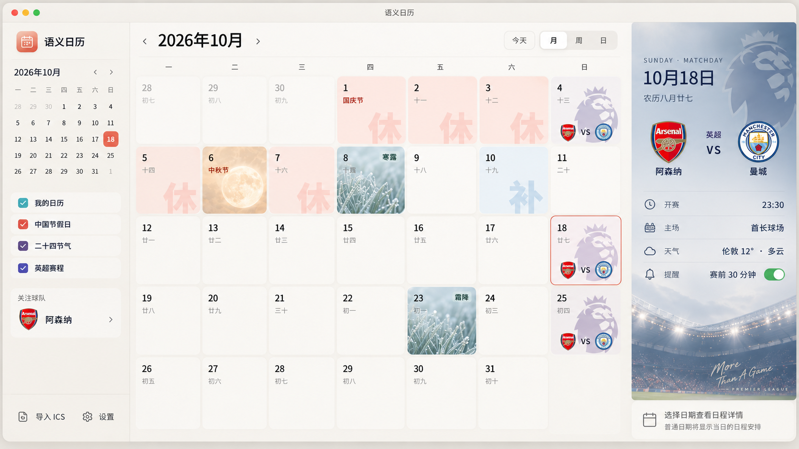
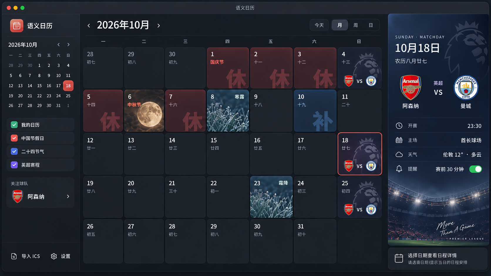

# Semantic Calendar UI Spec

> 文档状态：v0.1 UI 基线  
> 适用范围：桌面端月视图优先（Tauri + WebView）  
> 目标：将当前已确认的 UI 方向固化为可实现、可测试、可继续迭代的设计规范。

---

## 1. 设计目标

Semantic Calendar 的界面重点不是“塞入更多信息”，而是让用户在月视图中快速理解日期本身的语义。

核心原则：

1. **月历是主角**：主日历区始终占据最大视觉面积。
2. **语义通过视觉表达**：节假日、补班、节气、传统节日、体育比赛，不应只依赖文字标签。
3. **详情按需展开**：月格只保留必要信息，完整信息进入右侧详情栏。
4. **特殊日特殊，普通日安静**：普通日期允许大量留白，不为了“填满界面”而制造卡片或信息。
5. **视觉层级稳定**：无论一个日期叠加多少语义，日期数字、农历和基本网格必须保持可读。
6. **浅色与深色是同一套设计系统**：不应设计成两套互不相关的皮肤。
7. **避免 Dashboard 化**：不增加无关统计、推荐、资讯或冗余“今日安排”模块。

---

## 2. 整体布局

桌面端默认采用三栏结构：

```text
┌──────────────┬────────────────────────────────────┬──────────────────┐
│ 左侧导航栏   │              月历主区域            │     右侧详情栏   │
│ Sidebar      │            Calendar Grid           │      Inspector   │
└──────────────┴────────────────────────────────────┴──────────────────┘
```

建议比例：

- 左侧栏：约 15%–17%
- 中央月历：约 62%–66%
- 右侧详情栏：约 19%–22%

优先保证中央月历空间。窗口缩小时，右侧栏应优先允许收起，其次是左侧栏。

### 2.1 顶部窗口区域

保留桌面应用的简洁窗口标题区域：

- 应用名统一使用中文：**语义日历**
- 标题栏不承担复杂操作
- 主要导航放在月历区域顶部
- 月 / 周 / 日切换使用轻量 segmented control
- “今天”独立为一个次级按钮

---

## 3. 应用图标与品牌区

左上角品牌区包含：

- 应用图标
- 中文名称“语义日历”

此前使用的粉色 / 珊瑚色圆角方块，定义为 **应用图标**，不是功能按钮。

### 3.1 应用图标方向

推荐：

- 圆角方形
- 珊瑚红 / 桃色渐变
- 内部使用极简“日历 / 日”语义图形
- 不使用复杂插画
- 在浅色、深色主题下保持同一个品牌识别

图标必须看起来像应用 Logo，而不是无含义的色块。

---

## 4. 左侧栏 Sidebar

左侧栏负责：

1. 小型月份导航
2. 数据源显示 / 隐藏
3. 关注球队
4. 导入 ICS
5. 设置（当前：明暗主题、关闭窗口行为；完整设置页由 SC-018 接线）

关闭窗口行为（SC-002）在侧栏用两项分段控件表达「隐藏到托盘 / 退出应用」，
并在控件下方写明该行为意味着“应用是否仍在运行”——状态不靠颜色单独传达。
文案用“隐藏”而不是“最小化”：最小化按钮仍是系统默认行为（最小化到任务栏），
只有关闭窗口才会走到托盘。

不承担：

- 日程详情
- 今日待办
- 新闻
- 推荐内容
- 统计面板

### 4.1 浅色主题

左侧栏不能使用接近纯黑的背景。

推荐采用：

- 暖灰
- 米灰
- 低饱和浅棕灰

与中央主区域形成轻微层次即可，不要求完全同色。

视觉目标：

> 看起来属于同一套浅色界面，而不是“黑色侧栏 + 白色应用”拼接。

### 4.2 深色主题

深色模式下左侧栏可以比中央区域略深，但不要形成纯黑断层。

推荐：

- Sidebar：深灰蓝 / 炭灰
- Main：略浅的深灰
- 卡片 / hover：再提高一层明度

### 4.3 数据源项

首期包含：

- 我的日历
- 中国节假日
- 二十四节气
- 英超赛程

使用小色块 / checkbox 作为来源识别，但不要让颜色成为唯一信息来源。

---

## 5. 月历主区域

月视图是第一版 UI 的核心。

### 5.1 基础结构

顶部包含：

- 上一月
- 当前年月，例如“2026年10月”
- 下一月
- 今天
- 月 / 周 / 日

月份标题需要拥有最高层级，但不能过度夸张。

### 5.2 日期格

每个日期格默认包含：

- 公历日数字
- 农历简写
- 可选语义内容

农历简写只占一行，放在公历日数字下方：

- 初一是农历月份边界，写月名（「八月」「闰四月」），让月份边界与闰月在一行里可见；
- 其余日期写农历日名（「初二」…「三十」）；
- 字号与字重明显低于公历日数字，长月名不得挤压或推移日期数字（SC-010）。

普通日期应保持克制，不增加多余卡片。

### 5.3 日期格圆角与间距

- 日期格保持统一圆角
- 格子之间留出清晰但较窄的间隔
- 不使用强阴影
- 通过明度、背景图、描边表达状态

---

## 6. 普通日期

普通日期是整个界面的“基线状态”。

月格中仅显示：

- 日期
- 农历
- 必要事件摘要（如果存在）

不要为没有特殊语义的日期强行增加：

- 装饰图标
- 背景图
- 大字号文字
- 无意义状态标签

普通日期越安静，节假日、节气和比赛日越容易被感知。

---

## 7. 中国法定节假日与连休

### 7.1 连休背景

连续放假日期需要形成连续视觉感。

不要把每一天做成互不相关的粉色卡片。

目标：

> 用户扫一眼整个月，即可看出一段连续假期。

可采用：

- 相同背景色系
- 相邻格视觉连续
- 边界弱化
- 统一语义大字

### 7.2 “休”字

假期格子使用一个放大的、半透明、不完整的 **“休”** 字作为背景元素。

规则：

- 位于右下区域
- 允许被格子边缘裁切
- 不得遮挡日期数字
- 透明度低
- 不溢出日期格

### 7.3 不再使用右上角“休”小徽标

右下角的大“休”已经承担语义表达，因此：

**禁止同时再显示右上角的小“休”标签。**

原因：

- 信息重复
- 视觉噪音
- 破坏简洁性

---

## 8. 补班日

补班与休假采用同一视觉语言，但颜色区分。

### 8.1 背景

补班日使用：

- 浅色主题：淡蓝 / 雾蓝背景
- 深色主题：低饱和深蓝背景

### 8.2 “补”字

右下角使用放大的、半透明、不完整的 **“补”** 字。

规则与“休”一致：

- 可裁切
- 不溢出格子
- 不遮挡日期数字
- 不重复增加右上角“班 / 补”小标签

---

## 9. 传统节日与二十四节气

特殊节日和节气允许出现专属背景。

例如：

- 中秋：月亮
- 寒露：露水、草叶
- 霜降：霜、冷色植物
- 清明：雨、青绿
- 冬至：冬季意象

### 9.1 日期格背景原则

特殊背景必须：

- 限制在日期格内部
- 不覆盖整个应用
- 保证文字对比度
- 不抢走整个日历的视觉主导权

优先采用：

- 图片局部裁切
- 渐变遮罩
- 降低饱和度
- 降低对比度

而不是完整高清照片直接铺底。

### 9.2 右侧详情栏

点击节气 / 特殊节日后，右侧栏可以使用更完整的主题背景。

例如寒露：

```text
THURSDAY · SOLAR TERM

寒露
COLD DEW

10月8日
农历八月廿七

露气寒冷
将凝结也。
```

可补充：

- 二十四节气序号
- 简短释义
- 日期信息

不做百科页面，不放大段知识文本。

---

## 10. 体育赛事日期格

第一阶段以英超为主要示例。

### 10.1 日期格视觉

比赛日格子采用：

- 联赛 Logo / 狮标作为大面积低透明度背景
- 背景 Logo 可很大
- **必须裁切在格子内部**
- 不允许溢出到相邻日期格

### 10.2 比赛信息

日期格只显示：

```text
队标   VS   队标
```

禁止在日期格中继续展示：

- 队名
- 开赛时间
- 球场
- 天气
- 提醒

这些属于右侧详情栏。

这样可以保证比赛格在月视图下依旧简洁。

---

## 11. 右侧栏：Inspector / Detail Panel

右侧栏的定义不是“日程列表”，而是：

> **当前选中日期 / 当前选中语义对象的详情面板。**

这是整个信息架构的关键。

右侧栏根据用户选中的内容改变状态。

### 11.1 状态类型

至少支持：

1. 普通日期
2. 普通事件
3. 节假日
4. 传统节日
5. 二十四节气
6. 体育赛事

未来可继续扩展，但不改变整体结构。

---

## 12. 普通日期的右侧栏

普通日期不需要填满。

推荐表现为极简“日期详情”：

```text
WEDNESDAY

10月14日
2026

农历九月初五
```

可选在下方非常轻地显示：

- 下一节气距离
- 当天普通事件
- “今日无特殊标记”

如果没有内容，可以直接留白。

### 12.1 视觉背景

普通日期可以使用超大、极淡的日期数字，例如：

```text
                   14
```

作为背景装饰。

这与“休”“补”的大字号语义背景形成统一设计语言。

### 12.2 不使用固定“今日安排”列表

右侧栏不要长期固定展示：

- 慢跑
- 阅读
- 待办
- 推荐

普通事件只有在确实存在时才展示。

---

## 13. 比赛日右侧栏

比赛日右侧栏以“比赛”为视觉中心，而不是在右栏再嵌套一张小卡片。

推荐结构：

```text
SUNDAY · MATCHDAY

10月18日
农历八月廿七

     Arsenal        Manchester City
       LOGO     VS      LOGO
      阿森纳            曼城

              英超

开赛                         23:30
主场                       酋长球场
天气                   伦敦 12° · 多云
提醒                     赛前 30 分钟
```

### 13.1 信息层级

一级：

- 日期
- 对阵双方
- 队徽

二级：

- 联赛
- 开赛时间

三级：

- 球场
- 天气
- 提醒

### 13.2 背景

比赛详情栏可使用：

- 深蓝 / 蓝灰渐变
- 巨大低透明度联赛 Logo
- 球场氛围图
- 球队 / 联赛主题色

但背景必须服务可读性。

---

## 14. 浅色主题中的右侧栏

浅色主题下，右侧赛事栏不能像一块突兀的深色海报贴在应用右侧。

推荐：

- 蓝灰色降低饱和度
- 右侧保持深色氛围，但整体提亮
- 左边缘做柔和渐变过渡
- 背景图片降低对比度
- 大面积使用半透明雾化层
- 赛事视觉集中在右侧和底部

目标：

> “它是主界面的一部分”，而不是“主界面旁边放了一张海报”。

---

## 15. 深色主题

深色主题沿用完全相同的信息架构。

### 15.1 基础层级

建议：

- App background：炭灰 / 深蓝灰
- Sidebar：略深
- Calendar cell：略亮
- Selected：清晰描边
- Detail panel：深蓝渐变

禁止大面积纯黑。

### 15.2 假期

休假：

- 暗红 / 酒红背景
- 半透明“休”

补班：

- 暗蓝背景
- 半透明“补”

### 15.3 特殊背景

中秋、寒露、霜降等图片需要：

- 降低亮度
- 降低局部高光
- 文字区域增加遮罩

避免图片在深色模式下突然出现高亮白块。

### 15.4 右侧赛事详情

深色主题中，比赛详情栏可以比浅色主题更沉浸。

允许：

- 深蓝
- 球场灯光
- 联赛 Logo 水印

但仍要保证与中央区域有平滑过渡。

---

## 16. 多语义冲突

一个日期可能同时包含：

- 法定假期
- 传统节日
- 节气
- 体育比赛
- 用户事件

不能把所有视觉元素同时放大。

核心规则：

> **一个日期格只允许一个主背景语义，但可以存在多个状态语义。**

### 16.1 建议优先级

主背景优先：

1. 传统节日 / 节气专属视觉
2. 体育联赛视觉
3. 假期 / 补班纯色语义
4. 普通日期背景

状态叠加：

- 休 / 补可以作为背景大字
- 比赛可以用队标 VS 队标
- 用户事件可使用底部细条 / 小点

这里的「休 / 补大字」属于上面第 3 项假期语义本身（§7.2 / §8.2 把它定义为背景元素），
不是一个可以叠到任意背景上的状态标记：**上面的优先级决定了主背景之后，只画那一个背景**。
因此被节日 / 节气专属视觉或联赛视觉拿走主背景的日子，不画假期底色、也不画大字
（参考图同此：10 月 4 日休假 + 比赛只画狮标与队标 VS 队标，10 月 6 日只画节日视觉）。
放假的说明与「第几天 / 共几天」由右侧详情栏承担，连休的连续性靠同一次假期里
每一天的同一支底色表达，不靠把某一天的所有语义都堆上去。

例如：

```text
10月6日
中秋 + 国庆假期 + 阿森纳比赛
```

可以采用：

- 中秋月亮作为主背景
- 比赛显示队标 VS 队标

不要再额外叠加一个巨大英超狮标。

---

## 17. 选中状态

选中日期必须清晰，但不改变日期格原有语义。

推荐：

- 细描边
- 轻微内发光 / 明度变化
- 不使用大面积高饱和填充

比赛、节气、节假日被选中后，仍应保持其原有背景。

---

## 18. Hover 与 Tooltip

### 18.1 比赛格

默认只显示：

```text
队标 VS 队标
```

Hover 队徽可以显示球队名。

Hover 整个比赛区域可显示：

- 对阵
- 开赛时间

但 tooltip 只作为辅助，不承担核心信息。

### 18.2 日期格

Hover 只做轻微背景 / 描边响应。

避免日期格整体上浮、强阴影或明显 3D 效果。

---

## 19. 动效

整体动效原则：

- 快
- 克制
- 不打扰

推荐：

- hover：100–150ms
- 选中切换：150–220ms
- 右侧详情内容淡入 / 位移：180–240ms
- Sidebar 收起：180–240ms

避免：

- 弹性过度动画
- 大面积模糊运动
- 页面级缩放
- 玻璃按钮反光动画

---

## 20. 颜色语义

颜色需要表达“类别”，而不是纯装饰。

建议语义：

| 类型 | 浅色主题 | 深色主题 |
| --- | --- | --- |
| 普通日期 | 暖白 / 米白 | 深灰蓝 |
| 放假 | 淡暖红 / 淡珊瑚 | 暗酒红 |
| 补班 | 淡蓝 / 雾蓝 | 暗蓝 |
| 节气 | 低饱和绿 / 青 / 蓝 | 深青 / 蓝灰 |
| 比赛 | 联赛紫 / 球队色低透明度 | 深紫 / 深蓝 |
| 选中 | 珊瑚红细描边 | 稍亮珊瑚红描边 |

不要让整个界面同时出现大量高饱和颜色。

---

## 21. 字体与排版

优先使用系统字体栈。

中文：

- Windows：Microsoft YaHei / system-ui
- macOS：PingFang SC / system-ui

数字与英文：

- system-ui
- 可在大日期中使用更有编辑感的 serif 作为装饰，但不作为基础正文

层级：

- 月份标题：大
- 日期数字：中
- 农历：小
- 语义标签：小但清晰
- 背景大字：大且极低透明度

---

## 22. 图像与 Logo 使用

赛事 Logo、球队徽标、节气图片都属于展示层资源。

实现时应：

- 保持固定容器比例
- 使用 object-fit
- 裁切在日期格内
- 按需加载
- 缓存
- 不因为素材尺寸不同改变格子布局

Logo 不能决定布局，布局决定 Logo 如何被显示。

---

## 23. 响应式与侧栏折叠

桌面应用仍需考虑窗口缩小。

建议响应顺序：

### 宽屏

```text
Sidebar + Calendar + Inspector
```

### 中等宽度

```text
Compact Sidebar + Calendar + Inspector
```

### 更窄

```text
Calendar + Inspector
Sidebar 折叠
```

### 最窄允许范围

```text
Calendar
Inspector 通过按钮临时展开
```

月历本身始终优先保留。

---

## 24. 可访问性

最低要求：

- 文字与背景有足够对比度
- 不仅通过颜色传递休 / 补 / 比赛状态
- 队徽有可访问名称
- 所有可点击区域可通过键盘聚焦
- selected / hover / focus 三种状态需要区分
- 深色主题避免纯白文字大面积刺眼
- 背景图片不能损害日期数字可读性

---

## 25. 第一版明确不做的 UI

v0.1 不加入：

- Dashboard 首页
- 新闻流
- 体育资讯
- 天气 Dashboard
- Todo 系统
- 大型统计图表
- 推荐内容
- AI 对话入口
- 多层嵌套卡片
- 为了填充右栏而生成的无意义内容

右侧栏的职责始终是：

> **解释当前选中的日期或事件。**

---

## 26. v0.1 月视图验收标准

实现完成时，至少应满足：

- [ ] 浅色 / 深色主题均可用
- [ ] 左侧栏可收起
- [ ] 右侧详情栏可收起
- [ ] 主月历在默认窗口尺寸下占据主要空间
- [ ] 缩到最小窗口尺寸时月历主体仍完整可访问（SC-002）
- [ ] 国庆连续假期视觉连续
- [ ] 假日不显示重复小“休”徽标
- [ ] 补班日使用淡蓝 / 深蓝语义背景
- [ ] “休”“补”大字均被日期格裁切
- [ ] 中秋、寒露、霜降等可显示专属背景
- [ ] 比赛日狮标不溢出格子
- [ ] 比赛格只显示“队标 VS 队标”
- [ ] 点击比赛后右侧显示完整比赛信息
- [ ] 普通日期右侧允许简洁留白
- [ ] 多语义日期不会出现视觉元素堆叠失控
- [ ] 浅色模式赛事详情栏与主界面自然融合
- [ ] 深色模式不存在大面积纯黑断层
- [ ] 应用品牌使用中文“语义日历”

---

## 27. 设计总结

Semantic Calendar 的 UI 不应该像传统日历那样只显示文本，也不应该变成一个复杂 Dashboard。

最终方向可以概括为：

> **以克制的月历网格作为骨架，以背景、图标和排版表达日期语义，以右侧 Inspector 展开完整信息。**

普通日期保持安静；特殊日期自然突出。

假期让用户一眼看出“连续休息”，补班一眼看出“需要上班”，节气通过视觉氛围被感知，比赛日只用队徽和联赛视觉建立识别，而所有详细信息都延后到用户主动选择之后。

这套规则应作为 v0.1 UI 实现的基线。后续如增加新的国家节日、联赛、体育项目或语义类型，应优先复用本规范，而不是为每一种内容单独发明一套界面。

## 参考示例图

以下示例图用于约束 v0.1 的 UI 方向，避免后续设计漂移：

### 浅色主题参考


说明：
- 作为浅色主题月视图 + 比赛日 Inspector 的视觉基准
- 重点参考整体布局、侧栏层级、比赛日详情融入方式、休/补/节气/赛事语义表达

### 深色主题参考


说明：
- 作为深色主题月视图 + 比赛日 Inspector 的视觉基准
- 重点参考深色层级、赛事详情面板、比赛日格子、整体氛围与信息密度
